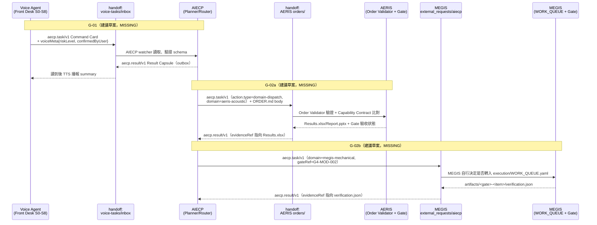

# Data Flow — Human → Voice → AIECP → Domain → Execution → Verify → Evidence → Approval → GitHub/Release

## 目標資料流（TO-BE，使用者確認的核心流程）

```text
1. Human 說話
        │
        ▼
2. Voice Agent（STT / Intent / HMI，於 ULTRA-MAERA-2）
        │  結構化任務請求
        ▼
3. AIECP（Mission / Task / Queue，於 ULTRA-MAERA-2）
        │  依領域路由
        ├──────────────┬──────────────┐
        ▼              ▼              ▼
4. AERIS         MEGIS          （其他未來領域）
   (聲學工程權威)  (機構工程權威)
        │              │
        ▼              ▼
5. Execution（三選一，依任務性質）
   a. ULTRA-MAERA-2 本機工具（唯讀/低風險）
   b. SPARK-AGAVE-3（FAST，批次/高 token/低風險）
   c. Cloud Worker（Codex/Claude/Gemini，經 Provider Router）
        │
        ▼
6. Verify
   a. SPARK-AGAVE-4（DEEP，獨立驗證/紅隊/審查）
   b. 獨立 Reviewer（人類或 AI，不可為原 Builder 本人）
   c. 確定性 Verifier（測試 exit code，非 LLM 自稱）
        │
        ▼
7. Evidence（雜湊化、可重現、跨重啟存活）
        │
        ▼
8. Human Approval（RED 等級操作，exact-action digest 核准）
        │
        ▼
9. GitHub / Release（受管分支、CI 通過、人工合併）
```

## 現況資料流（AS-IS，本輪盤點證實可運作的部分）

```text
路徑 A（已驗證運作）：
  Human 語音 → Offline-Local-Voice-Agent（RTX Spark 硬體，完全離線）
             → Structured Tool Call → Policy Engine → Executor（Windows 桌面操作）
             → 本機安全分級 L0-L3（已驗證約95%）

路徑 B（已驗證運作，獨立於路徑 A）：
  Human 語音/文字 → Offline-Local-Voice-Agent → ORDER.md 檔案
             → AERIS Core（Blueprint 層）→（Implementation 層驗收 NOT VERIFIED）

路徑 C（架構完整、部分 ENVIRONMENT gate 待補）：
  Human → 官方 ChatGPT Web → aecp.task/v1 Command Card
        → AIECP Harness（Planner→Builder→Verify→Reviewer，通用，非特定工程領域）
        → GitHub（Draft PR，exact-HEAD CI）
        → 人工核准合併

路徑 D（規劃中，P0 尚未開始）：
  Human 語音 → ChatGPT 桌面 Voice → Codex → sb CLI
        → SuperBrain Router（config/routing.yaml 靜態分流）
        → SPARK-AGAVE-3（FAST）或 SPARK-AGAVE-4（DEEP）或雲端工人
        → SQLite state + JSONL audit
        → 語音回報摘要

路徑 A/B/C/D 目前彼此獨立，沒有任何一條真正串接成使用者設想的完整九步驟流程。
```

## 落差對照表

| 目標流程步驟 | 現況對應 | 缺口 |
|---|---|---|
| 2. Voice Agent → 3. AIECP | 路徑 A/B 顯示 Voice Agent 目前只送到本機 Executor 或 AERIS | 缺 Voice Agent → AIECP 的 schema/API |
| 3. AIECP → 4. AERIS/MEGIS | 路徑 C 顯示 AIECP 目前只做通用 Git 任務，不路由到領域 repo | 缺 AIECP 的領域路由邏輯，以及 AERIS/MEGIS 可被呼叫的介面 |
| 5b. SPARK-AGAVE-3 執行 | 路徑 D 顯示 SuperBrain 仍在 P0，SPARK-AGAVE-3 尚未有任何真實任務跑過 | 需完成 P0-P5 才有真實執行證據 |
| 6a. SPARK-AGAVE-4 驗證 SPARK-AGAVE-3 | 完全沒有實作，也沒有協議設計 | 見 Audit/GAP_ANALYSIS.md |
| 9. GitHub/Release | 路徑 C 的 AIECP 自己的 GitHub delivery 已經很成熟（exact-HEAD CI、簽章 webhook） | 這部分反而是目前最接近目標的一段，但只服務 AIECP 自己的 repo，不服務 AERIS/MEGIS 的發布（AERIS 有自己獨立的 Supervision 發布機制） |

## G-01／G-02 建議草案之間的資料/證據流（Mermaid）

> 對照 [Blueprint/20](../Blueprint/20_PROPOSED_INTERFACE_CONTRACTS.md) 的 G-01（Voice Agent↔AIECP）與 G-02（AIECP↔AERIS/MEGIS）草案，畫出建議中的 payload 與證據回填路徑。**全部節點與連線都是 DRAFT，未經任何來源 repo 採用**，只是把 Blueprint/20 的文字描述可視化。



**關鍵設計原則（沿用 Blueprint/20）**：兩條 G-02 路徑都堅持「檔案交接、不共用 runtime」，因為 MEGIS 明文禁止與 AERIS/Voice Agent 共用環境（`0_JN1_MEGIS/execution/PROJECT_STATE.md` 第80行），AERIS 與 Voice Agent 的既有整合模式也是同一種哲學（`ORDER.md`）。AIECP 在兩條路徑上都只回填 `evidenceRef`，不強迫 AERIS/MEGIS 改用 AIECP 自己的五級證據格式，證據等級對照只是概念層級（見 Blueprint/20 G-02 章節）。
