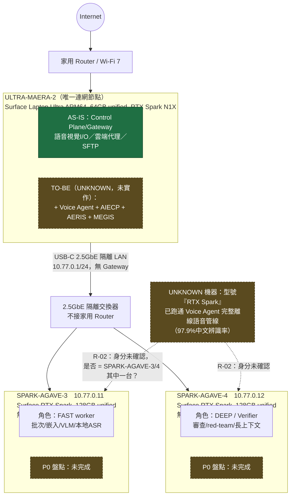

# Machine Map

機器命名與規格來源：`0_JN1_2AGAVE128-1MAERA64/.ai/STATUS.md`（2026-09-25 決策）與 `.ai/BLUEPRINT.md` §3。

```text
                         Internet
                            │
                     家用 Router / Wi-Fi 7
                            │
              ┌─────────────┴──────────────┐
              │       ULTRA-MAERA-2         │  ← 唯一連網節點
              │  Surface Laptop Ultra ARM64 │     不做 NAT、不轉送封包
              │  64GB unified / 24GB→GPU    │
              │  RTX Spark N1X GPU          │
              │                             │
              │  現狀：Control Plane/Gateway│
              │  /語音視覺I/O/雲端代理/SFTP  │
              │                             │
              │  目標（TO-BE，未實作）：      │
              │  + Voice Agent              │
              │  + AIECP                    │
              │  + AERIS                    │
              │  + MEGIS                    │
              └──────────────┬──────────────┘
                             │ USB-C 2.5GbE（隔離 LAN，10.77.0.1/24，無 Gateway）
              ┌──────────────┴──────────────┐
              │      2.5GbE 隔離交換器        │  ← 不接家用 Router
              └───┬─────────────────────┬────┘
                  │                     │
        ┌─────────▼─────────┐ ┌─────────▼─────────┐
        │  SPARK-AGAVE-3     │ │  SPARK-AGAVE-4     │
        │  10.77.0.11        │ │  10.77.0.12        │
        │  Surface RTX Spark │ │  Surface RTX Spark │
        │  128GB unified     │ │  128GB unified     │
        │  無 Default GW/DNS │ │  無 Default GW/DNS │
        │                    │ │                    │
        │  角色：FAST worker │ │  角色：DEEP /       │
        │  批次/嵌入/VLM/    │ │  Verifier/審查/     │
        │  本地 ASR          │ │  red-team/長上下文  │
        │                    │ │                    │
        │  P0 盤點：未完成    │ │  P0 盤點：未完成    │
        └────────────────────┘ └────────────────────┘

注意：Offline-Local-Voice-Agent 目前已在一台「型號為 RTX Spark」的機器上跑通 ASR/LLM，
但無法確認是否為 SPARK-AGAVE-3 或 SPARK-AGAVE-4 這兩台具名機器中的任何一台（見
Audit/CONFLICT_ANALYSIS.md C-02）。這是機器盤點中唯一的身分不確定項。
```

## 三機佈局（Mermaid）

> 依 [Blueprint/03](../Blueprint/03_MACHINE_ARCHITECTURE.md) 現有結論繪製，不新增任何未經來源文件證實的部署事實。凡 Blueprint/03 已標記 `UNKNOWN`／`NOT VERIFIED` 的機器指派，本圖同樣標記為 `UNKNOWN`，不擅自畫成確定連線。



**圖例**：綠色實心 = Blueprint/03 已確認的 AS-IS 事實；虛線/黃棕色 = `UNKNOWN`／`NOT VERIFIED`（含目標部署與 R-02 機器身分不確定性），完全比照 [Blueprint/03](../Blueprint/03_MACHINE_ARCHITECTURE.md) 與本檔案上方文字結論，不新增推測。

## 機器 ↔ 專案對照現況

| 機器 | 目標要跑的服務（TO-BE） | 目前實際確認在跑的服務（AS-IS） |
|---|---|---|
| ULTRA-MAERA-2 | Voice Agent、AIECP、AERIS、MEGIS | `UNKNOWN`——SuperBrain 藍圖只定義通用角色，未提及任何領域專案部署於此 |
| SPARK-AGAVE-3 | AIECP/SuperBrain 派工的 FAST worker | 尚未盤點（P0 未完成）；可能與 Voice Agent 使用的 RTX Spark 為同款硬體但身分未確認 |
| SPARK-AGAVE-4 | 獨立驗證/審查的 DEEP node | 尚未盤點（P0 未完成） |
