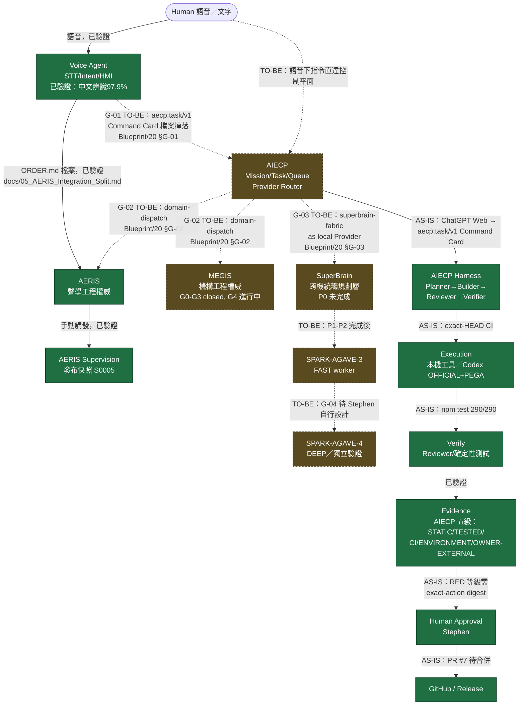

# System Map

> 這張圖畫的是**使用者確認的目標架構（TO-BE）**，不是目前任何 repo 已實作的現狀。目前現狀請見 [Audit/REPOSITORY_INVENTORY.md](../Audit/REPOSITORY_INVENTORY.md) 與 [Audit/CONFLICT_ANALYSIS.md](../Audit/CONFLICT_ANALYSIS.md) C-01。

## 目標架構（TO-BE）

```text
                              ┌───────────────────────────┐
                              │          Human             │
                              │        (Stephen)           │
                              └──────────────┬──────────────┘
                                             │ 語音 / 文字
                                             ▼
                         ┌───────────────────────────────────────┐
                         │            ULTRA-MAERA-2                │
                         │   主控電腦 / HMI / Internet Gateway      │
                         │  ┌───────────┐  ┌─────────────────────┐│
                         │  │Voice Agent│─▶│        AIECP          ││
                         │  │(STT/Intent│  │ Mission/Task/Queue    ││
                         │  │  /HMI)    │  │ Planner→Builder→      ││
                         │  └───────────┘  │ Reviewer→Verifier     ││
                         │                 │ Git/CI/Evidence/      ││
                         │                 │ Approval/Provider     ││
                         │                 │ Router                ││
                         │                 └──────┬───────┬────────┘│
                         │        ┌────────────────┘       │        │
                         │        ▼                        ▼        │
                         │  ┌───────────┐          ┌───────────┐   │
                         │  │   AERIS   │          │   MEGIS   │   │
                         │  │(acoustic  │          │(mechanical│   │
                         │  │ domain)   │          │ domain)   │   │
                         │  └───────────┘          └───────────┘   │
                         └──────────────┬──────────────┬────────────┘
                                        │              │
                         ┌──────────────▼──┐        ┌──▼───────────────┐
                         │  SPARK-AGAVE-3   │        │  SPARK-AGAVE-4    │
                         │  FAST worker     │        │  DEEP / verify    │
                         │  local LLM       │        │  reviewer, audit  │
                         │  batch/high-token│        │  red-team, QA gate│
                         └──────────────────┘        └────────────────────┘

                    SuperBrain = ULTRA-MAERA-2 + SPARK-AGAVE-3 + SPARK-AGAVE-4（合稱運算織理）
```

## 現狀架構（AS-IS，本輪盤點證實）

```text
   Human                Human                    Human
     │                    │                         │
     ▼                    ▼                         ▼
┌─────────────┐   ┌───────────────┐         ┌───────────────┐
│ Voice Agent │   │ ChatGPT Web   │         │ ChatGPT Web/   │
│ (RTX Spark, │   │  ──▶ AIECP    │         │ Claude/Gemini  │
│ 完全離線)    │   │ (通用 Git 控制 │         │  ──▶ SuperBrain│
└──────┬──────┘   │  平面)        │         │ (規劃中，P0未起)│
       │ ORDER.md │└───────────────┘         └───────────────┘
       ▼
┌─────────────┐        ┌──────────────────────┐
│ AERIS Core   │◀──────│ AERIS Local Impl      │
│ (Blueprint)  │       │ (aeris_runtime)       │
└──────┬───────┘       └───────────────────────┘
       │ 手動觸發
       ▼
┌─────────────────┐        獨立、互不知道彼此存在：
│ AERIS Supervision│        MEGIS（C:\0_JN1_MEGIS，明確聲明不與 AERIS/Voice Agent 共用環境）
│ (發布快照)        │        AIECP（通用控制平面，未綁定任何工程領域）
└──────────────────┘        SuperBrain（通用多機調度，未提及任何領域專案）
```

**結論**：現狀是五～六座孤島，各自有自己完整的治理/驗收/證據體系，彼此之間只有一條已知的橋（Voice Agent ↔ AERIS 的 `ORDER.md`）。目標架構要求的其餘所有連線目前都是 `MISSING`（見 [Registry/INTERFACES.yaml](../Registry/INTERFACES.yaml)）。

## 合併視圖（Mermaid）：human → voice → AIECP → domain → execution → verify → evidence → approval → release

> 圖例：**實線 = AS-IS（本輪盤點證實可運作）**；**虛線 = TO-BE（目標架構，目前 MISSING/規劃中，未實作）**。虛線上的 `G-0x` 標記對應 [Blueprint/17](../Blueprint/17_RISK_GAP_CONFLICT_REGISTER.md) 的缺口編號與 [Blueprint/20](../Blueprint/20_PROPOSED_INTERFACE_CONTRACTS.md) 的建議草案，草案本身尚未被任何來源 repo 採用。



**如何讀這張圖**：AIECP 目前確實存在且運作（灰底綠色節點的 Harness 分支），但它服務的是「ChatGPT Web → 通用 Git 任務」這條線，**不是**圖中虛線描繪的「Voice Agent → AIECP → 領域路由 → SuperBrain」目標流程；後者整條路徑目前都是建議草案（[Blueprint/20](../Blueprint/20_PROPOSED_INTERFACE_CONTRACTS.md)），尚未有任何一段被來源 repo 實作。
